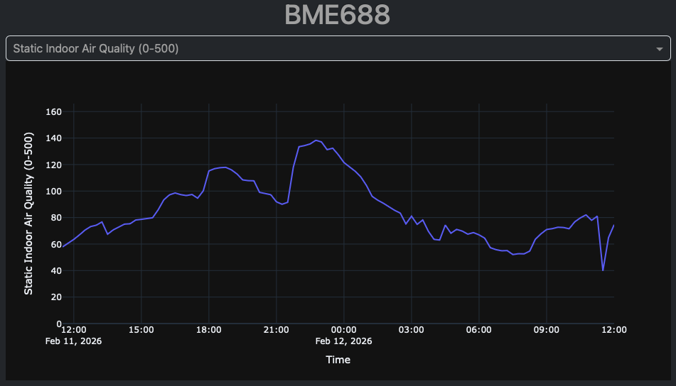
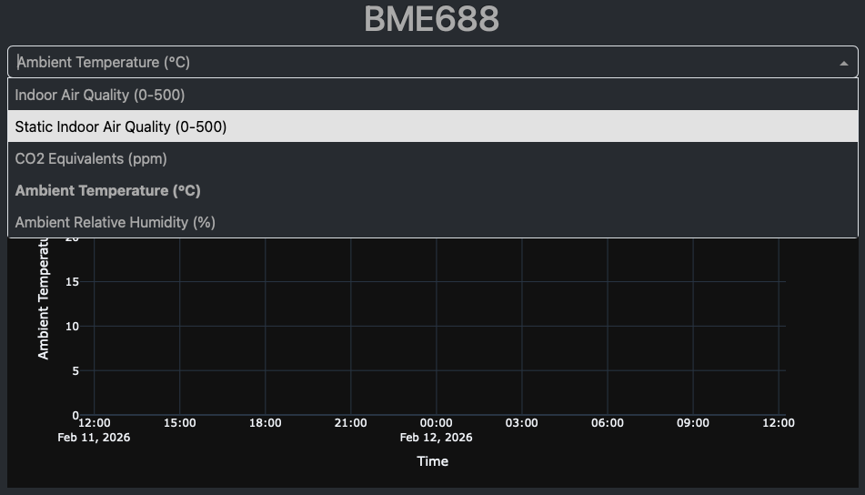
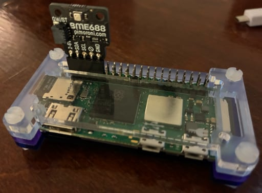

# BME688 Web View
Web view for BME688 air quality sensor.

Reference: [electro-dan.co.uk](https://electro-dan.co.uk/pc/raspberry-pi-air-quality-meter/)

## Screenshots





## Hardware

Any modern (RAM >= 512 MB) Raspberry Pi should work fine. Below is a picture of my setup with a Raspberry Pi Zero 2 W enclosed in a [Pibow Zero 2 W](https://shop.pimoroni.com/products/pibow-zero-2-w) case with a [Pimoroni BME688](https://shop.pimoroni.com/products/bme688-breakout) sensor with a female right angle header soldered on sticking out.




## Setup

### 1. Database
These steps are for **MariaDB**.
1. Create user `db_user` with write privileges for logger and add password to `logger/password.txt`.
2. Create user `db_reader` with read-only privileges for view and add password to `view/password.txt`.
3. Create database `bme688_telemetry`.
4. Create a table inside `bme688_telemetry` called `time_series`:

```sql
CREATE TABLE time_series (
timestamp DATETIME NOT NULL,
iaq DECIMAL(5, 2),
iaq_accuracy TINYINT(1) UNSIGNED,
static_iaq DECIMAL(5, 2),
static_iaq_accuracy TINYINT(1) UNSIGNED,
co2_equivalent DECIMAL(6, 2),
co2_accuracy TINYINT(1) UNSIGNED,
breath_voc_equivalent DECIMAL(5, 1),
breath_voc_accuracy TINYINT(1) UNSIGNED,
raw_temperature DECIMAL(4, 2),
raw_pressure DECIMAL(8, 2),
raw_humidity DECIMAL(5, 2),
raw_gas DECIMAL(8, 2),
stabilization_status TINYINT,
run_in_status TINYINT, 
temperature DECIMAL(4, 2),
humidity DECIMAL(5, 2),
gas_percentage DECIMAL(4, 1),
gas_percentage_accuracy TINYINT(1) UNSIGNED
);
```

5. Enable scheduler:

```sql
SET @@GLOBAL.event_scheduler = ON;
```

6. Create event that hourly cleans up measurements that are one day old. If you want to see measurements on a longer time scale, just change the `INTERVAL` value.

```sql
CREATE EVENT AutoDeleteExpiredRows
ON SCHEDULE 
EVERY 1 HOUR
DO
BEGIN
DELETE LOW_PRIORITY FROM bme688_telemetry.time_series WHERE timestamp < DATE_SUB(NOW(), INTERVAL 1 DAY);
END
```

### 2. Logger

1. Create virtual environment in folder `logger`:
```bash
python -m venv env
```
2. Activate virtual environment:
```bash
source env/bin/activate
```
3. Install MySQLdb and [BME68x](https://github.com/mcalisterkm/bme68x-python-library-bsec2.6.1.0) Python packages. You might also want to run [burn_in.py](https://github.com/mcalisterkm/bme68x-python-library-bsec2.6.1.0/blob/main/examples/burn_in.py) and provide your own `state_bme688.txt` file for more accurate measurements.
4. Deactivate virtual environment:
```bash
deactivate
```
5. Copy service file:
```bash
sudo cp bme688_logger.service /etc/systemd/system/
```
6. Edit service file to match your directory structure:
```bash
sudo nano /etc/systemd/system/bme688_logger.service
```
7. Reload services and enable and start logger:
```bash
sudo systemctl daemon-reload
sudo systemctl enable bme688_logger
sudo systemctl start bme688_logger
```

The logger service will now write measurements to the database at XX:00, XX:15, XX:30 and XX:45.

### 3. Web view

1. Create virtual environment in folder `view`:
```bash
python -m venv env
```
2. Activate virtual environment:
```bash
source env/bin/activate
```
3. Install packages:
```bash
pip install -r requirements.txt
```
4. Deactivate virtual environment:
```bash
deactivate
```
5. Copy service file:
```bash
sudo cp bme688_view.service /etc/systemd/system/
```
6. Edit service file to match your directory structure:
```bash
sudo nano /etc/systemd/system/bme688_view.service
```
7. Reload services and enable and start web view:
```bash
sudo systemctl daemon-reload
sudo systemctl enable bme688_view
sudo systemctl start bme688_view
```

You should now be able to see your BME688 at your Raspberry Pi's port `8050`.

### Notes

You can see more data in the dropdown menu by uncommenting lines from `col_to_label` declaration in `bme688_view.py`.

Dash, by default, gets some resources from external CDNs. We have our own server, so relying on other servers is not necessary. To fix this, I added the required `.css` files to the `assets` folder and added these two lines of code:
```python
app.css.config.serve_locally = True
app.scripts.config.serve_locally = True
```

Speaking of `.css` files, if you don't like the current theme (SLATE), you can download other themes [here](https://www.dash-bootstrap-components.com/docs/themes/). Then update this part of `bme688_view.py`:
```python
SLATE = "assets/slate/bootstrap.min.css"
app = Dash(external_stylesheets=[SLATE])
```

You can change the look of the graph, by changing the `template` parameter here:
```python
fig = px.line(data_frame=df, x="timestamp", y=val, labels=col_to_label, template="plotly_dark")
```

It also seems like the database connection will eventually timeout and reloading the page will at first show a broken graph. Adding `pool_pre_ping=True` to the `create_engine` call fixed this.
